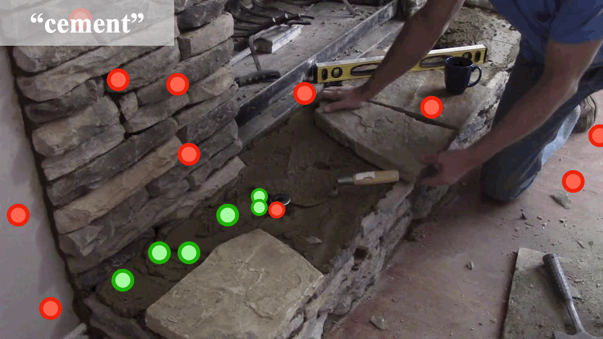
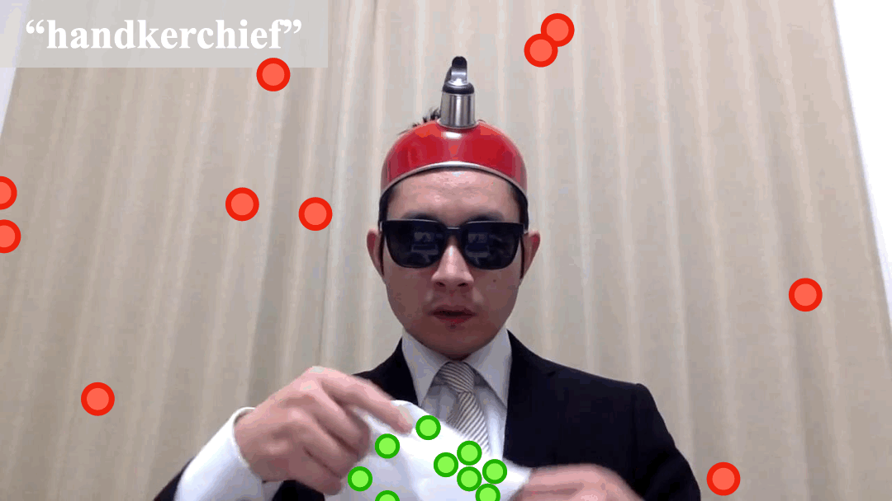
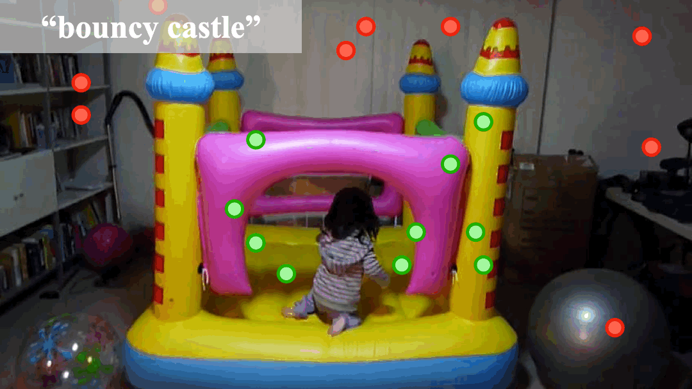
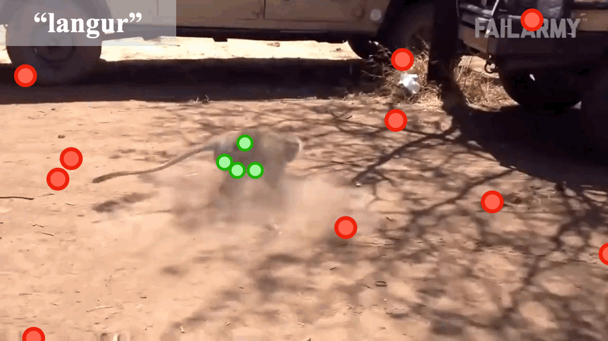
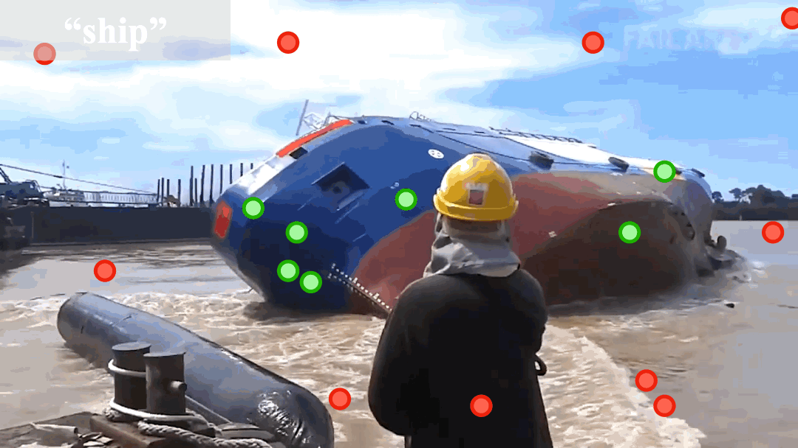
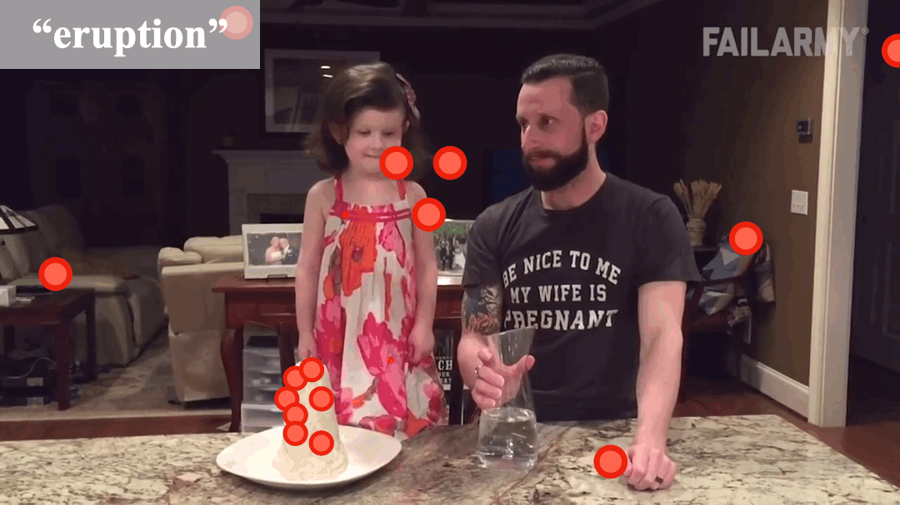

# PointVOS
Official data release and code for ["Point-VOS: Pointing Up Video Object Segmentation"](https://pointvos.github.io/), CVPR 2024!

<div align="left">
    
    
  
</div>
<be>
<div align="left">
    
    
  
</div>

## Updates
**16.07.2024:** Initially, we are uploading the annotations of the datasets. 

**TODOs:**
- [x] Release of the datasets.
- [ ] Release of the dataset scripts.
- [ ] Release of the training code.

## Environment Setup
**Dependencies**
- Python 3.8.0
- CUDA 11.3
- GCC 10.0.0
- CUDNN 8.5.0
- Pytorch 1.8.0
- Torchvision 0.9.0

1. Create a conda environment with Python 3.8
```shell 
conda create --name pointvos python=3.8
conda activate  pointvos
```
2. Install PyTorch v1.8.0
```shell 
conda install pytorch==1.8.0 torchvision==0.9.0 torchaudio==0.8.0 cudatoolkit=11.1 -c pytorch -c conda-forge
```
3. Install other dependencies from pip
```shell 
pip install -r requirements.txt
```
4. Add the PointVOS repo to `PYTHONATH`. The following command should be run from the repository base dir
```shell 
export PYTHONPATH="${PYTHONPATH}:${pwd}"
```

## Point-VOS Oops and Point-VOS Kinetics Datasets
Please download the full set of Point-VOS Oops and Point-VOS Kinetics Annotations:

:dart: [Point-VOS Oops](https://omnomnom.vision.rwth-aachen.de/data/PointVOS/annotations/Oops/)    

🚀[Point-VOS Kinetics](https://omnomnom.vision.rwth-aachen.de/data/PointVOS/annotations/Kinetics/)

The annotations are in `JSON` or `JSONL` format. We provide the annotations of `Point-VOS Oops` and `Point-VOS Kinetics` datasets separately. `Point-VOS Oops` consists of the train and val splits, and `Point-VOS Kinetics` only the train split.

In addition to the annotation files, we also share the extracted annotations and JPEG images. However, these files are quite large, so it takes some time to download them.

Example format of the annotations: 
```shell
question_hash: 		String.
			A unique string identifier of the question, e.g. "69e69b3a8b29d92dd94be66c79f82d69"
question: 		String.
			Processed question used to decide the single-foreground object, e.g.  "Who throws the egg at the man?".
object_name:		String.
			Processed answer indicates the single-foreground object, e.g. "baby girl".
video_name: 		String.
			The name of the video this point annotation belongs to, e.g. "train/False Start! - Best Fails of the Week! (May 2018) _ FailArmy31" 
annotated_points:	List of dictionaries.
			Each dictionary has one point annotation with the following items:	
			x: Integer. The x coordinate of the point annotation.
			y: Integer. The y coordinate of the point annotation. 
			frame_id: String. The frame of the video where the given point annotation is presented. 
status: 		String.
			The status of the point annotation.
			There are three statuses for each point annotation that are "ACCEPTED", "REJECTED", and "AMBIGUOUS".
			"ACCEPTED" indicates the point annotation is accepted by the annotator for being a foreground point.
			"REJECTED" indicates the point annotation is rejected by the annotator for being a foreground point and it is annotated as a background point.
			"AMBIGUOUS" indicates the point annotation is ambiguous for the annotator that could not be decided for either being a foreground or a background point.
			The point annotations with "AMBIGUOUS" status are not included in the final annotations of the PointVOS benchmark.
			They are presented in the annotation file for statistical purposes.
is_fg_candidate': 	Bool.
			The flag indicates the point annotation is generated as a foreground point by the semi-automatic annotation tool. 
```
**Note:** The videos are sparsely annotated, i.e. not all frames in the videos are annotated. Only 10 frames are annotated for each video in the dataset.

## Citation
```BibTeX
@inproceedings{zulfikar2024point,
  title={Point-VOS: Pointing Up Video Object Segmentation},
  author={Zulfikar, Idil Esen and Mahadevan, Sabarinath and Voigtlaender, Paul and Leibe, Bastian},
  journal={Proceedings of the IEEE/CVF Conference on Computer Vision and Pattern Recognition},
  year={2024}
}
```
